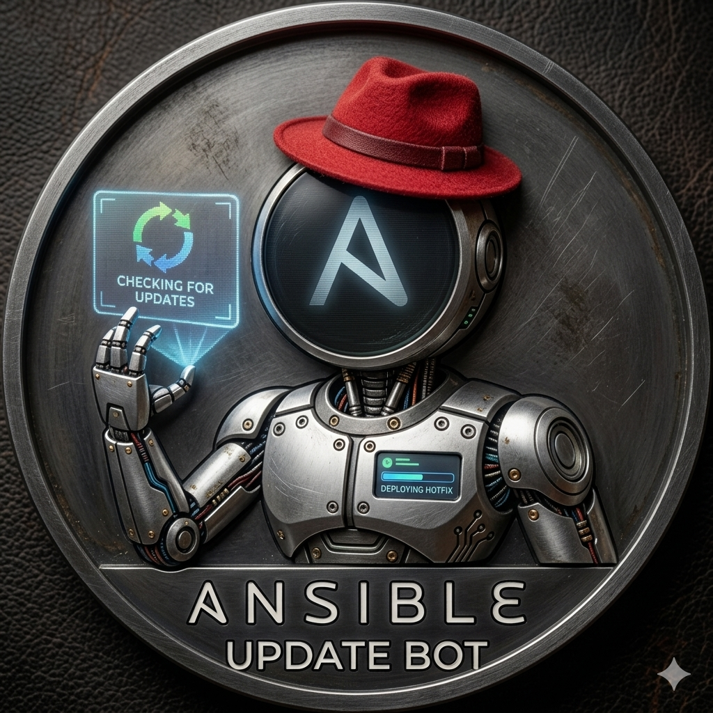

# 🔄 Updates-Bot



A Discord bot that orchestrates system updates across multiple homelab servers via Ansible, with real-time progress reporting.

## ✨ Key Features

- **Ansible playbook execution:** triggers package updates on managed nodes from a Discord command.
- **Live progress embeds:** updates the Discord message in real time while the playbook runs, instead of only reporting on completion.
- **Per-run logs:** saves an independent log for each run for later auditing.
- **Phased update detection:** supports Ubuntu's phased update rollout system, avoiding false negatives when a package hasn't yet been released to a given machine.

## 🧰 Stack

- Python
- discord.py
- Ansible (invoked as a subprocess or via API)

## 🚀 Installation

```bash
git clone https://github.com/Lucacux/Updates-Bot.git
cd Updates-Bot
python3 -m venv venv
source venv/bin/activate
pip install -r requirements.txt
cp .env.example .env  # fill in your real values
cp ansible/inventory/hosts.ini.example ansible/inventory/hosts.ini  # fill in your real hosts
python main.py
```

## ⚙️ Environment Variables

See `.env.example` — bot token, reporting channel, and update schedule.

See `ansible/inventory/hosts.ini.example` — the Ansible inventory: your Arch/Ubuntu hosts, SSH user, port, and private key path.

## 📄 License

Personal infrastructure project — free to use as reference.
